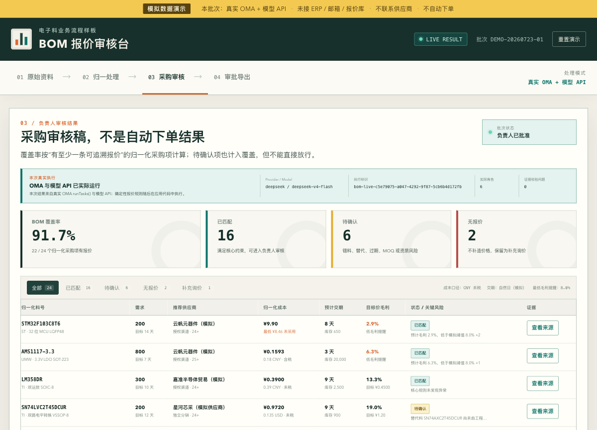

# 电子料 BOM 报价审核台 Demo

一个独立、本地可运行的深圳 ToB 售前场景 Demo：把混乱的客户 BOM 和多格式供应商回复，整理成可追溯、可人工审批、可导出的采购审核稿。

> 全部公司、联系人、邮箱、价格、库存和业务数据均为虚构模拟数据。当前没有接入真实 ERP、报价库、邮箱或供应商系统，不会联系供应商，也不会自动下单。



## 两条演示路径

### 主路径：真实 OMA + DeepSeek API

- 真实调用 npm 依赖 `@open-multi-agent/core@1.12.1`；
- 真实执行 OMA `runTasks()` 固定 DAG；
- 1 个 BOM 分析角色与 4 个供应商读取角色并行；
- 1 个独立证据复核角色依赖上述 5 个结果；
- 模型负责多格式抽取、歧义提示和证据复核；
- 价格、汇率、税费、库存、交期、MOQ、资质、推荐、毛利、审批和导出仍由应用侧确定性代码控制。

实时执行失败会明确停止，不会自动切到离线结果。

### 备用路径：明确标注的离线回放

- 不调用 OMA，不调用模型，不需要 API Key；
- 只读取版本化回放包，并重新运行当前确定性业务规则；
- 页面、审计和导出始终标记为 `OFFLINE_REPLAY`；
- 当前仓库内置的是 2026-07-23 验收生成的 `LIVE_OMA_CAPTURE`：它来自一次真实 OMA `runTasks()` + DeepSeek 对模拟 fixture 的处理。打开回放时不会再次调用模型，页面仍明确标记为离线回放。

## 安装与启动

环境要求：Node.js 22.x、npm 10.x。

```bash
git clone https://github.com/YuanASI/oma-bom-quote-demo.git && cd oma-bom-quote-demo
npm ci --cache .npm-cache
cp .env.example .env
```

在 `.env` 中只填写本地 Key，不要提交：

```dotenv
DEEPSEEK_API_KEY=你的_Key
OMA_PROVIDER=deepseek
OMA_MODEL=deepseek-v4-flash
OMA_PORT=5173
```

先验证真实 provider，再启动：

```bash
npm run preflight:oma
npm run dev
```

打开 `http://127.0.0.1:5173`。启动命令会自动读取本地 `.env`；Key 只由本地 Node 服务读取，不会进入浏览器 bundle 或接口响应。

默认模型是 `deepseek-v4-flash`。DeepSeek 的模型支持面会变化，正式演示前应以[官方模型列表](https://api-docs.deepseek.com/api/list-models)和[官方更新记录](https://api-docs.deepseek.com/updates/)复核。

如果暂时没有 Key，仍可直接运行 `npm run dev`，在首页手动选择「离线回放」。实时按钮会显示阻塞状态，不会伪装为可用。

## 公网部署形态

公开版本固定挂载在 `/demos/bom-quote-review/`，API 使用
`/api/demos/bom-quote-review/*`。生产容器默认启用 `OMA_PUBLIC_DEMO=1`：

- 浏览器不显示文件上传入口；
- 服务端只接受仓库内置模拟 fixture，修改后的请求会被拒绝；
- 每个 IP 默认每天最多 2 次实时执行；
- 全站默认每天最多 30 次实时执行；
- 默认最多 2 个实时请求并发；
- 达到限制时返回真实 `429`，离线回放仍可由用户手动选择；
- 日志只记录 request ID、耗时、角色数、Token 和校验问题数量，不记录输入正文。

生产环境变量：

```dotenv
DEEPSEEK_API_KEY=服务端密钥
OMA_PROVIDER=deepseek
OMA_MODEL=deepseek-v4-flash
OMA_PUBLIC_DEMO=1
OMA_PUBLIC_IP_DAILY_LIMIT=2
OMA_PUBLIC_TOTAL_DAILY_LIMIT=30
OMA_PUBLIC_MAX_CONCURRENT=2
```

构建与运行：

```bash
docker build -t oma-bom-quote-demo .
docker run --rm -p 5173:5173 \
  -e DEEPSEEK_API_KEY \
  -e OMA_PUBLIC_DEMO=1 \
  oma-bom-quote-demo
```

健康检查为 `/healthz`。公开容器只应位于反向代理后的内部网络，不直接暴露端口。

## 三分钟主路径

1. 查看 26 行模拟 BOM，以及 CSV、自然语言邮件正文和 JSON 三种供应商回复。
2. 保持「真实 OMA + DeepSeek」并点击「运行真实 OMA 审核」。
3. 处理完成后查看执行凭证，再打开采购审核稿：26 行合并为 24 个采购项，16 个已匹配、6 个待确认、2 个无报价，覆盖率 91.7%。
4. 打开一行来源，核对原始价格、币种、税费、库存、MOQ、交期、Date Code、渠道、资质和原文证据。
5. 人工改选、标记补询，再由负责人批准、驳回或退回并填写备注。
6. 导出客户报价草稿、内部采购审核表、异常清单和 JSON 审计记录。

逐秒话术见 [`docs/3-minute-demo-script.md`](docs/3-minute-demo-script.md)。

## 重置

- 页面右上角「重置演示」；
- 或刷新浏览器；
- `npm run reset` 输出重置说明。

重置会恢复 bundled fixture，并清空页面内的人工改选、补询标记和审批记录。它不会删除 `.env`，也不会改写回放包。

## 模拟数据集

`fixtures/` 是 bundled 数据源。所有文件都明确包含“模拟数据”声明，邮箱均使用保留域名 `.invalid`。

| 文件 | 格式 | 内容 |
|---|---|---|
| `customer-bom.csv` | CSV | 26 行 BOM；含重复、缺品牌、疑似错料号 |
| `supplier-01-yunfan.csv` | CSV | 虚构授权渠道；CNY 含税 |
| `supplier-02-xinghe-email.txt` | 邮件正文 | 虚构独立分销商；USD 未税；自然语言行文 |
| `supplier-03-lingfeng.json` | JSON | 虚构 Broker；HKD 未税；资质待核 |
| `supplier-04-jiazhun.csv` | CSV | 虚构授权渠道；CNY 未税 |

共 45 条模拟报价，覆盖：

- 报价过期；
- 最低价但交期不满足；
- 料号歧义；
- 库存无法完全覆盖；
- 替代料未经工程确认；
- 供应商资质待审核；
- 数量低于 MOQ；
- 币种和税费口径不一致；
- 低毛利提醒；
- 完全无报价。

界面允许导入同结构的本地模拟文件。实时模式会把这些明确标记为模拟的数据经本地服务发送到模型；离线回放只对应内置 fixture，不处理新导入文件。

## 处理与证据边界

OMA / 模型输出必须通过 Zod 结构校验。每条模型报价还必须满足：

- 原文摘录确实出现在对应源文件；
- 摘录包含料号和价格数字；
- 模型置信度不低于 0.70；
- 没有未解决的必填字段。

不满足时该报价会被丢弃并记录校验问题，应用不会补造价格。

确定性规则：

- 基准日期：2026-07-23；
- 模拟汇率：USD/CNY 7.20、HKD/CNY 0.92；
- CNY 含税价按模拟 13% 税率还原；
- 重复料号合并，保留原 BOM 行；
- 先检查有效期、交期、库存、MOQ、资质和替代料状态，再比较成本；
- 无安全候选时保留“待确认”，无来源时保留“无报价”；
- 目标毛利低于 8% 只提醒，不替代负责人判断。

## 验证命令

不需要 Key：

```bash
npm run verify
```

依次执行 lint、TypeScript、Vitest、运行边界扫描和生产构建。测试中的 fixture adapters 会真实经过 OMA `runTasks()` 调度，但不会访问外部模型。

需要真实 DeepSeek Key：

```bash
npm run preflight:oma
npm run test:e2e:oma
npm run capture:replay
```

- `preflight:oma`：一次最小真实模型结构化输出；
- `test:e2e:oma`：完整 6 角色 OMA 流水线；
- `capture:replay`：仅在完整真实执行成功后写入 `LIVE_OMA_CAPTURE` 回放包。

## 项目结构

```text
fixtures/              模拟 BOM、四家供应商回复、版本化回放包
server/                本地 API、OMA 工作流、证据校验、回放
src/components/        原始输入、处理、审核、审批、导出界面
src/domain/            确定性解析、归一化、比较、导出和测试
scripts/               provider 预检、真实 E2E、回放捕获、边界检查
docs/                  演示脚本、能力边界、试点建议和验收记录
```

## 售前配套

- [`docs/3-minute-demo-script.md`](docs/3-minute-demo-script.md)
- [`docs/capability-boundary.md`](docs/capability-boundary.md)
- [`docs/audience-talk-tracks.md`](docs/audience-talk-tracks.md)
- [`docs/follow-up-questions.md`](docs/follow-up-questions.md)
- [`docs/historical-replay-next-step.md`](docs/historical-replay-next-step.md)
- [`docs/delivery-status.md`](docs/delivery-status.md)
- [`docs/validation-log.md`](docs/validation-log.md)

## License

本项目以 MIT 许可证开源，详见 [`LICENSE`](LICENSE)。
